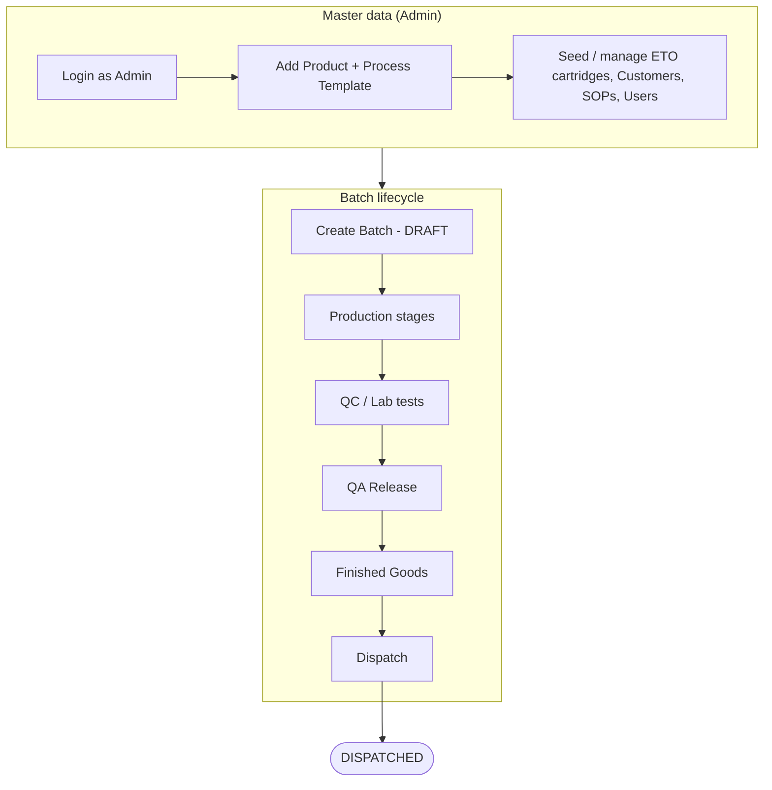
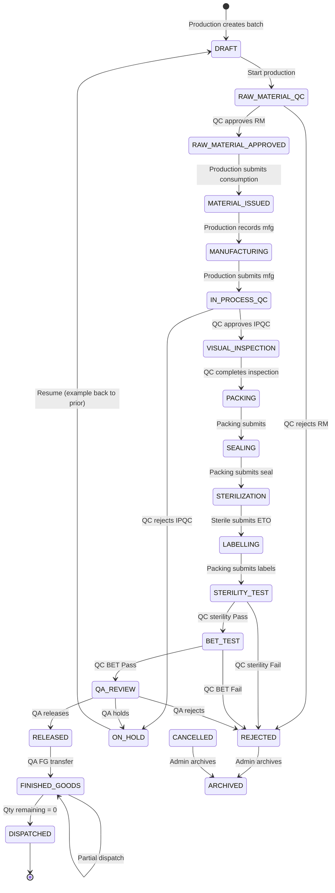
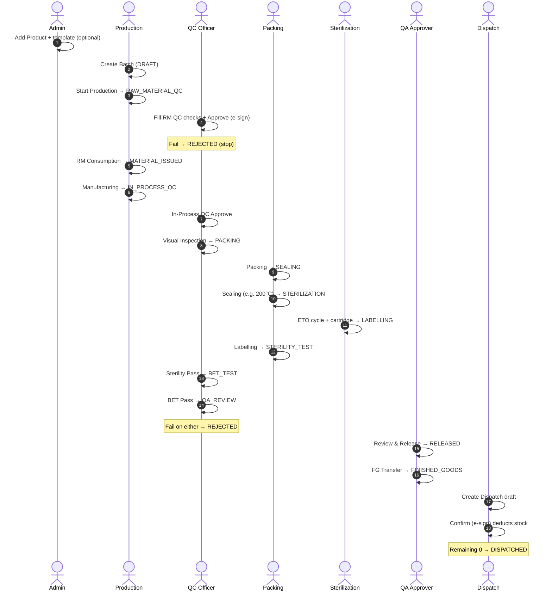
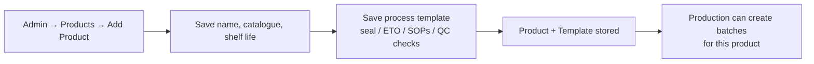
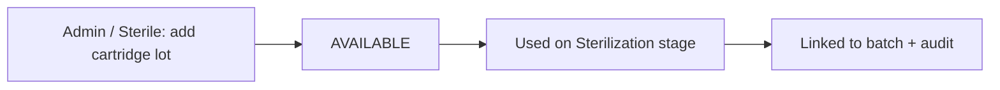
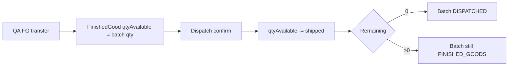
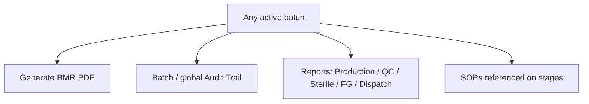

# SureTech eBMR — Working Flow (Detailed)

This document describes the **live working flow** of the system: who does what, in what order, and what happens to batch status.

---

## 1. Big picture

---

## 2. Roles and responsibilities

| Role | Login | Main jobs |
|------|--------|-----------|
| **Admin** | `admin@suretech.local` | Products, users, config; can perform any stage |
| **Production Chemist** | `production@…` | Create/start batch, RM issue, manufacturing |
| **QC Officer** | `qc@…` | RM QC, IPQC, visual inspection, sterility, BET |
| **Packing Operator** | `packing@…` | Packing, sealing, labelling |
| **Sterilization Operator** | `sterilization@…` | ETO cycle + cartridge usage |
| **QA Approver** | `qa@…` | Final review/release, FG transfer, hold/cancel |
| **Dispatch User** | `dispatch@…` | Create & confirm shipments |

**Electronic signature:** at Submit / Approve / Reject / Confirm, the user re-enters **their password**. Stage then locks; action is written to the **audit trail**.

---

## 3. End-to-end batch flow (status machine)

---

## 4. Swimlane — who works when

---

## 5. Stage-by-stage working detail

```mermaid
flowchart TD
  Start([Start]) --> P0

  subgraph P["① Production"]
    P0[Create batch<br/>product, batch size, mfg date]
    P1[Status: DRAFT]
    P2[Start Production]
    P3[Status: RAW_MATERIAL_QC]
    P0 --> P1 --> P2 --> P3
  end

  subgraph Q1["② QC — Raw Material"]
    Q1a[Enter RM QC checks<br/>Pass/Fail per process]
    Q1b{Approve?}
    Q1c[RAW_MATERIAL_APPROVED]
    Q1d[REJECTED]
    Q1a --> Q1b
    Q1b -->|Yes e-sign| Q1c
    Q1b -->|No| Q1d
  end

  P3 --> Q1a

  subgraph P2b["③ Production — Issue & Make"]
    P4[Record RM consumption lines]
    P5[MATERIAL_ISSUED]
    P6[Record manufacturing data]
    P7[IN_PROCESS_QC]
    P4 --> P5 --> P6 --> P7
  end

  Q1c --> P4

  subgraph Q2["④ QC — IPQC & Visual"]
    Q2a[In-Process QC]
    Q2b{Approve IPQC?}
    Q2c[VISUAL_INSPECTION]
    Q2d[ON_HOLD]
    Q2e[Complete visual inspection]
    Q2f[PACKING]
    Q2a --> Q2b
    Q2b -->|Yes| Q2c --> Q2e --> Q2f
    Q2b -->|No| Q2d
  end

  P7 --> Q2a

  subgraph PK["⑤ Packing"]
    K1[Packing submit]
    K2[SEALING]
    K3[Sealing submit<br/>temp vs template]
    K4[STERILIZATION]
    K1 --> K2 --> K3 --> K4
  end

  Q2f --> K1

  subgraph ST["⑥ Sterilization"]
    S1[Record ETO cycle<br/>temp / time / cartridge]
    S2[LABELLING]
    S1 --> S2
  end

  K4 --> S1

  subgraph LB["⑦ Packing — Label"]
    L1[Batch labelling submit]
    L2[STERILITY_TEST]
    L1 --> L2
  end

  S2 --> L1

  subgraph Q3["⑧ QC — Lab"]
    L3[Sterility test]
    L3a{Pass?}
    L4[BET_TEST]
    L5[BET test]
    L5a{Pass?}
    L6[QA_REVIEW]
    RX[REJECTED]
    L3 --> L3a
    L3a -->|Yes| L4 --> L5 --> L5a
    L3a -->|No| RX
    L5a -->|Yes| L6
    L5a -->|No| RX
  end

  L2 --> L3

  subgraph QA["⑨ QA"]
    QA1[Review full BMR]
    QA2{Decision}
    QA3[RELEASED]
    QA4[ON_HOLD / REJECTED]
    QA5[Transfer to Finished Goods]
    QA6[FINISHED_GOODS<br/>stock available]
    QA1 --> QA2
    QA2 -->|Release e-sign| QA3 --> QA5 --> QA6
    QA2 -->|Hold/Reject| QA4
  end

  L6 --> QA1

  subgraph DI["⑩ Dispatch"]
    D1[Select customer + qty]
    D2[Draft dispatch]
    D3[Confirm e-sign<br/>deduct FG stock]
    D4{Qty left = 0?}
    D5[DISPATCHED]
    D6[Stay FINISHED_GOODS]
    D1 --> D2 --> D3 --> D4
    D4 -->|Yes| D5
    D4 -->|No| D6
  end

  QA6 --> D1
```

---

## 6. Supporting flows (outside the main line)

### 6.1 Product creation (Admin)

### 6.2 ETO cartridge

### 6.3 Finished goods & dispatch stock

### 6.4 Documents & visibility

---

## 7. Demo path (fast walkthrough)

Use these logins in order (password for demos: `Demo@12345`, admin: `Admin@12345`):

1. **admin** — (optional) Add Product  
2. **production** — Create Batch → Start → Consumption → Manufacturing  
3. **qc** — RM QC approve → IPQC → Visual Inspection  
4. **packing** — Packing → Sealing  
5. **sterilization** — ETO  
6. **packing** — Labelling  
7. **qc** — Sterility Pass → BET Pass  
8. **qa** — Release → FG Transfer  
9. **dispatch** — Confirm dispatch → **DISPATCHED**

---

## 8. Exception paths (summary)

| Situation | Who | Result |
|-----------|-----|--------|
| RM / Sterility / BET / QA fail | QC or QA | **REJECTED** (batch stops) |
| IPQC fail / QA hold | QC or QA | **ON_HOLD** |
| Cancel batch | Admin / QA | **CANCELLED** |
| Archive closed bad batch | Admin | **ARCHIVED** |
| Stage after submit | System | Stage **locked**; changes need correction/unlock |

---

## 9. App map (screens vs flow)

| Step | Typical screen |
|------|----------------|
| Create / list | `/batches`, `/batches/create` |
| Batch hub | `/batches/:id` (stage chips + timeline) |
| Each stage | `/batches/:id/raw-material`, `…/manufacturing`, `…/qc`, … |
| FG inventory | `/inventory` |
| Dispatch | `/dispatches`, `/customers` |
| Masters | `/products`, `/eto-cartridges`, `/sops`, `/users` |
| Oversight | `/dashboard`, `/reports`, `/audit-logs` |

For status transition rules in table form, see `TECHNICAL_SPECIFICATION.md` §4.
